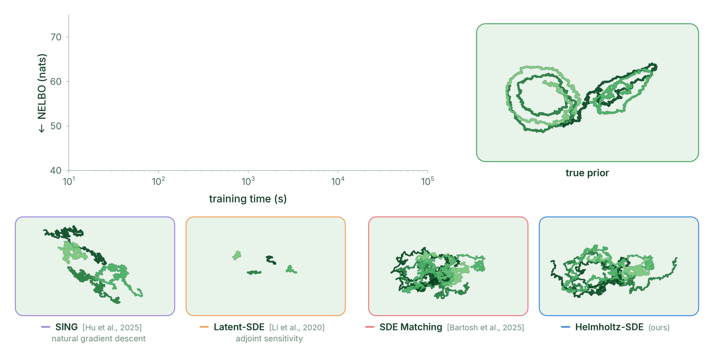

# Helmholtz-SDE
This repository contains code for the paper

**Closing the Approximation Gap in Simulation-free Latent SDEs** \
Henry D. Smith, Brian L. Trippe, Scott W. Linderman \
Advances in Neural Information Processing Systems \
[arXiv preprint](https://arxiv.org/abs/2606.16138) \
[OpenReview]()

Helmholtz-SDE is a simulation-free variational inference (VI) algorithm for latent stochastic differential equations (latent SDEs).
Helmholtz-SDE can provide **order-of-magnitude speedups** over VI algorithms that require numerical simulation, such as latent-SDE `(Li et al., 2020)` and `Archambeau et al., 2007`. 
Compared to recent VI algorithms that do not require simulation, such as SVISE `(Course and Nair, 2023)` and SDE Matching `(Bartosh et al., 2025)`, Helmholtz-SDE uses a **more expressive variational family**.

<p align="center">
  
</p>

## Getting started
For an introduction to the Helmholtz-SDE codebase, we recommend reviewing the [notebook](experiments/lorenz/lorenz_attractor.ipynb) for the Lorenz attractor dataset. 

The notebook can also be run in [Google Colab](https://colab.research.google.com/github/lindermanlab/helmholtz-sde/blob/main/experiments/lorenz/lorenz_attractor.ipynb) (GPU runtime recommended) without a local install.

## Installation
To install Helmholtz-SDE, we recommend using a virtual environment (e.g., conda) with Python version `>=3.12`.
First, run:
```
pip install -U pip
```
Then, install JAX version in your virtual environment via the instructions [here](https://docs.jax.dev/en/latest/installation.html). 
We install JAX version `0.5.3` with GPU support using the command:
```
pip install -U "jax[cuda12]==0.5.3" "jaxlib==0.5.3"
```
You should change `cuda12` to your cuda driver version.
Then install the `helmholtz_sde` package and its dependencies with:
```
pip install -e .
```

Helmholtz-SDE also relies on [SING](https://github.com/lindermanlab/sing) `(Hu et al., 2025)`.
A modified copy is contained in `sing/`. Install this local copy in editable mode with:
```
pip install -e sing/
```

The code under `experiments/` additionally uses `pandas`, `scipy`, `scikit-learn` and `juliacall`. 
To install these dependencies as well, run:
```
pip install -e ".[experiments]"
```

## Content
The `helmholtz_sde` package is organized as follows:
- `sde.py`: the prior SDE `p(x)`
- `likelihood.py`: the likelihood model `p(y | x)`
- `data.py`: data processing for the training loop
- `train.py`: the training loop `train`
- `posterior/`: the approximate posterior SDE `q(x)`
- `helmholtz/`: divergence-free corrections to the reference posterior drift
- `utils/`: utility functions, including for the divergence-free correction (`hermite.py` and `quadrature.py`), SDE simulation (`general_helpers.py`), and plotting (`plotting.py`)

`train.py` contains the primary function `train` used for performing approximate inference and learning.
As described in the manuscript, specifying the variational family amounts to (i) specifying the reference posterior drift `fq` and (ii) specifying the _divergence-free correction_ to the reference drift.

Helmholtz-SDE supports two options for the reference posterior drift: `sqrt` (from `Bartosh et al., 2025`)  and `sym` (from `Course and Nair, 2023`). 
It is specified via the `gauge` argument:
```python
train(..., gauge="sym") # SVISE (Course and Nair, 2023)
train(..., gauge="sqrt") # SDE Matching (Bartosh et al., 2025)
```
`sqrt` is the default.

There are two supported divergence-free corrections, `LeastSquaresCorrection` and `TaylorCorrection`.
The divergence-free correction is passed to `train` as an object. 
```python
from helmholtz_sde.helmholtz.subspace import LeastSquaresCorrection
from helmholtz_sde.helmholtz.taylor import TaylorCorrection

train(..., gauge="sqrt", div_free=LeastSquaresCorrection(ell=1, kappa=1, n_mc=1)) # projection 
train(..., gauge="sqrt", div_free=TaylorCorrection(ell=1)) # Taylor approximation
train(..., gauge="sqrt", div_free=None) # no correction
```
`LeastSquaresCorrection(ell=1, kappa=1, n_mc=1)` is the default.

## Experiments
Each subdirectory of `experiments/` corresponds to one experimental setting:
- `lorenz/`: the noisy Lorenz attractor
- `ou_spiral/`: a linear SDE (Ornstein-Uhlenbeck spiral), used for the inference and learning experiments
- `rotifer_algae/`: the `Blasius et al., 2020` rotifer-algae dataset
- `2d_cylinder/`: fluid flow past a 2D cylinder, via proper orthogonal decomposition (POD)

All experimental scripts and notebooks share the helpers in `experiments/experiment_utils.py`. 
Datasets are not shipped with the repository; each subdirectory explains how to obtain the necessary datasets for that experiment.

## Tests
Tests for the `helmholtz_sde` package are in `tests/test_helmholtz.py`.
They can be run with:
```
pytest tests -q
```

## Citation
```
@article{smith2026helmholtz,
  title={Closing the Approximation Gap in Simulation-free Latent SDEs},
  author={Smith, Henry D. and Trippe, Brian L. and Linderman, Scott W.},
  journal={arXiv preprint arXiv:2606.16138},
  year={2026}
}
```

## AI usage
AI assistance was used when writing the codebase. 
All code was reviewed and tested by the authors.
